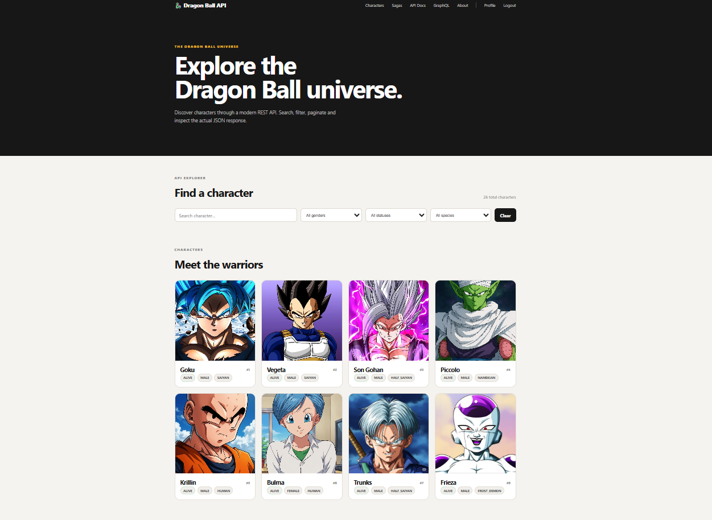

# 🐉 Dragon Ball API

A developer-focused **Dragon Ball API platform** inspired by public APIs such as PokeAPI and Futurama API.

Explore Dragon Ball characters and sagas through a clean web interface, or consume the data through **REST, GraphQL, and Server-Sent Events (SSE)**.

---

## 🌐 Live Demo

**Frontend:** https://dragonball-api-vert.vercel.app

**Backend:** https://dragonball-api-y81f.onrender.com

**Swagger Docs:** https://dragonball-api-y81f.onrender.com/docs

---


### Character Collection




---


## ✨ Features

- 🐉 Dragon Ball character database
- ⚔️ Saga and character relationships
- 🔎 Search and filtering
- 📄 Pagination
- 🔌 REST API
- 🕸️ GraphQL API
- ⚡ Server-Sent Events for real-time activity
- 🔐 JWT authentication
- 📚 Interactive API documentation
- 🖼️ Character and saga images
- 🧾 JSON API responses displayed directly in the frontend
- 📱 Responsive React interface

---

## 🏗️ Architecture

```text
                    ┌──────────────────────┐
                    │      React / Vite    │
                    │      Frontend        │
                    │       Vercel         │
                    └──────────┬───────────┘
                               │
                            HTTPS
                               │
                               ▼
                    ┌──────────────────────┐
                    │       FastAPI        │
                    │       Backend        │
                    │        Render        │
                    └──────────┬───────────┘
                               │
                         SQLAlchemy
                               │
                               ▼
                    ┌──────────────────────┐
                    │   Neon PostgreSQL    │
                    │      Database        │
                    └──────────────────────┘
```

---

## 🛠️ Tech Stack

### Backend

- Python
- FastAPI
- SQLAlchemy
- PostgreSQL
- Alembic
- Strawberry GraphQL
- SSE-Starlette
- JWT Authentication
- Pydantic

### Frontend

- React
- Vite
- React Router
- CSS
- Fetch API
- Lucide React
- Framer Motion

### Deployment

- Neon PostgreSQL
- Render
- Vercel
- GitHub

---

# 🔌 REST API

Base URL:

```text
https://dragonball-api-y81f.onrender.com
```

## Characters

### Get Characters

```http
GET /api/v1/characters
```

Example:

```http
GET /api/v1/characters?page=1&limit=8
```

### Search

```http
GET /api/v1/characters?name=goku
```

### Filter by Gender

```http
GET /api/v1/characters?gender=MALE
```

### Filter by Status

```http
GET /api/v1/characters?status=ALIVE
```

### Filter by Species

```http
GET /api/v1/characters?species=SAIYAN
```

### Get Character

```http
GET /api/v1/characters/{id}
```

### Get Character Sagas

```http
GET /api/v1/characters/{id}/sagas
```

---

## Sagas

### Get Sagas

```http
GET /api/v1/sagas
```

### Get Saga

```http
GET /api/v1/sagas/{id}
```

### Get Saga Characters

```http
GET /api/v1/sagas/{id}/characters
```

---

# 🔐 Authentication

### Sign Up

```http
POST /api/v1/auth/signup
```

Example:

```json
{
  "username": "goku_fan",
  "email": "goku@example.com",
  "password": "StrongPassword123!"
}
```

### Login

```http
POST /api/v1/auth/login
```

Returns a JWT access token.

### Current User

```http
GET /api/v1/auth/me
```

Use:

```http
Authorization: Bearer <access_token>
```

---

# 🕸️ GraphQL

GraphQL endpoint:

```text
https://dragonball-api-y81f.onrender.com/graphql
```

Example:

```graphql
query {
  characters {
    id
    name
    gender
    status
    species
  }
}
```

Character with sagas:

```graphql
query {
  character(id: 1) {
    id
    name
    gender
    status
    species
    sagas {
      id
      name
    }
  }
}
```

---

# ⚡ Server-Sent Events

Live event stream:

```http
GET /api/v1/events
```

Event history:

```http
GET /api/v1/events/history
```

Supported events include:

```text
character_created
character_updated
character_deleted
character_added_to_saga
```

The frontend displays these events through the **Live Activity** panel.

---

# 🧾 Example JSON Response

```json
{
  "items": [
    {
      "id": 1,
      "name": "Goku",
      "gender": "MALE",
      "status": "ALIVE",
      "species": "SAIYAN",
      "created_at": "2026-10-04T00:00:00",
      "image": "/static/images/characters/goku.jpeg"
    }
  ],
  "page": 1,
  "limit": 8,
  "total": 26,
  "pages": 4
}
```

The frontend also displays the JSON response directly in the API Explorer.

---

# 📚 Documentation

Swagger/OpenAPI:

```text
https://dragonball-api-y81f.onrender.com/docs
```

The frontend also includes a custom documentation page.

---

# 📁 Project Structure

```text
dragonball-api/
│
├── alembic/
│   └── versions/
│
├── app/
│   ├── graphql/
│   ├── models/
│   ├── routers/
│   ├── schemas/
│   ├── services/
│   ├── database.py
│   └── main.py
│
├── static/
│   └── images/
│       ├── characters/
│       └── sagas/
│
├── dragonball-web/
│   ├── src/
│   │   ├── components/
│   │   ├── pages/
│   │   └── ...
│   ├── package.json
│   └── vite.config.js
│
├── docker-compose.yml
├── requirements.txt
├── .python-version
├── .gitignore
└── README.md
```

---

# 🚀 Run Locally

## Backend

```powershell
git clone https://github.com/Raj-Mayank2/dragonball-api.git
cd dragonball-api
```

Create a virtual environment:

```powershell
python -m venv venv
.\venv\Scripts\Activate.ps1
```

Install dependencies:

```powershell
pip install -r requirements.txt
```

Create `.env`:

```env
DATABASE_URL=your_neon_database_url
SECRET_KEY=your_secret_key
ALGORITHM=HS256
ACCESS_TOKEN_EXPIRE_MINUTES=30
FRONTEND_URL=http://localhost:5173
```

Run migrations:

```powershell
alembic upgrade head
```

Start API:

```powershell
uvicorn app.main:app --reload
```

Backend:

```text
http://127.0.0.1:8000
```

Swagger:

```text
http://127.0.0.1:8000/docs
```

---

## Frontend

```powershell
cd dragonball-web
npm install
```

Create `.env`:

```env
VITE_API_URL=http://127.0.0.1:8000
```

Run:

```powershell
npm run dev
```

Frontend:

```text
http://localhost:5173
```

---

# 🗄️ Database

Production uses **Neon PostgreSQL** with SQLAlchemy and Alembic.

Main tables:

```text
characters
sagas
character_saga
users
alembic_version
```

---

# ☁️ Deployment

### Frontend
Vercel

### Backend
Render

### Database
Neon PostgreSQL

Production flow:

```text
Vercel React
     ↓
Render FastAPI
     ↓
Neon PostgreSQL
```

---

# 🎯 Use Cases

The API can be used to build:

- Dragon Ball fan websites
- Character search applications
- Quiz applications
- Character comparison tools
- Dashboards and visualizations
- Discord / Telegram bots
- REST and GraphQL learning projects
- Real-time event-driven applications

---

# 🔒 Security

Keep sensitive values in environment variables.

Never commit:

```text
.env
DATABASE_URL
SECRET_KEY
JWT secrets
```

The frontend API URL is intentionally public because the browser needs it to communicate with the backend.

---

## 👨‍💻 Developer

**Mayank Raj**

GitHub:  
https://github.com/Raj-Mayank2

Portfolio:  
https://mayankraj12.netlify.app/

---

## ⭐ Project Goal

Dragon Ball API is built as a **developer-first public API and explorer**:

```text
Discover Dragon Ball data
          ↓
Explore it through the website
          ↓
Consume it through REST / GraphQL
          ↓
Build your own applications
```

Built for developers who love APIs and Dragon Ball.
